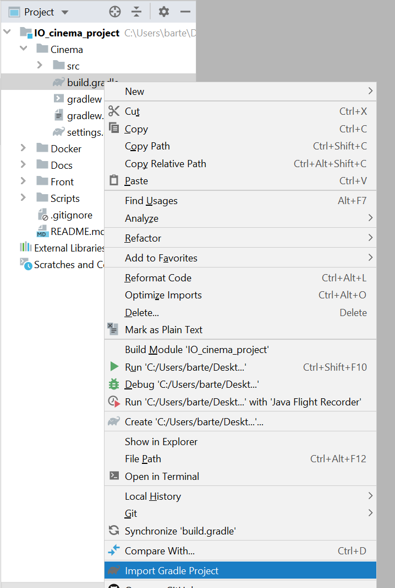
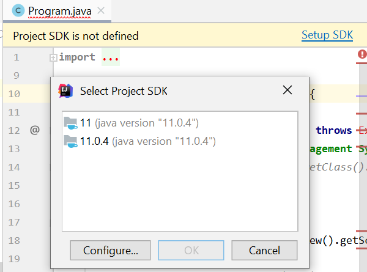
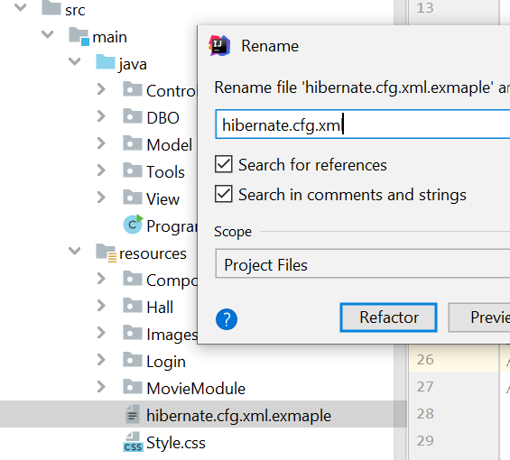
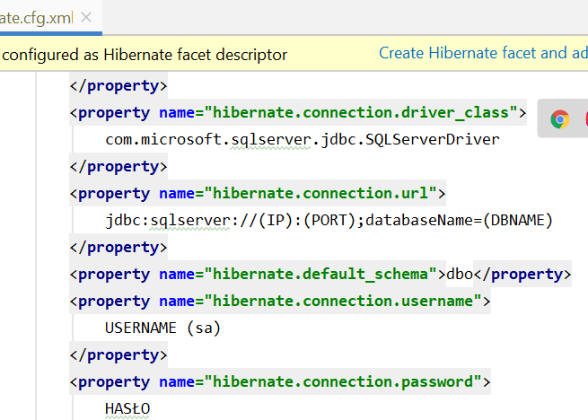

# IO_cinema_project
Software engineering classes project

# Catalog structure
```
Scripts - SQL/T-SQL scripts
Cinema - Thick client source code
Docker - Setup for MSSQL Docker database
Docs - Documentation and extra files
Front - PHP project of frontend application
```

# Package structure
```
Model - Model of data
View - GUI
Controller - Logic of application
DBO - Access to database
Tools - Non logic tools
```


# Plugins

Lombok - [link](https://projectlombok.org/setup/intellij)

# How to
summon @KK

Sclonuj repo w cli
```bash
git clone https://github.com/mkidawa/IO_cinema_project.git
```
Otwórz cały projekt w IntelliJ otwórz pakiet Cinema

W pakiecie Cinema kliknij PPM na `build.gradle` i wybierz `Import as Gradle Project` 



 `Setup SDK` wybierz takie które masz najlepiej `JDK8`



Nalezy zmienic  
```
Cinema/src/main/resources/hibernate.cfg.xml.example 
```
na
```
Cinema/src/main/resources/hibernate.cfg.xml 
```


Nalezy ustawić swoje połączenie do bazy danych albo skorzystać z plików w module `DOCKER` 
Rzeczy do zmiany są oznaczone w `()`




# Creditance

Icons made by Freepik from www.flaticon.com
